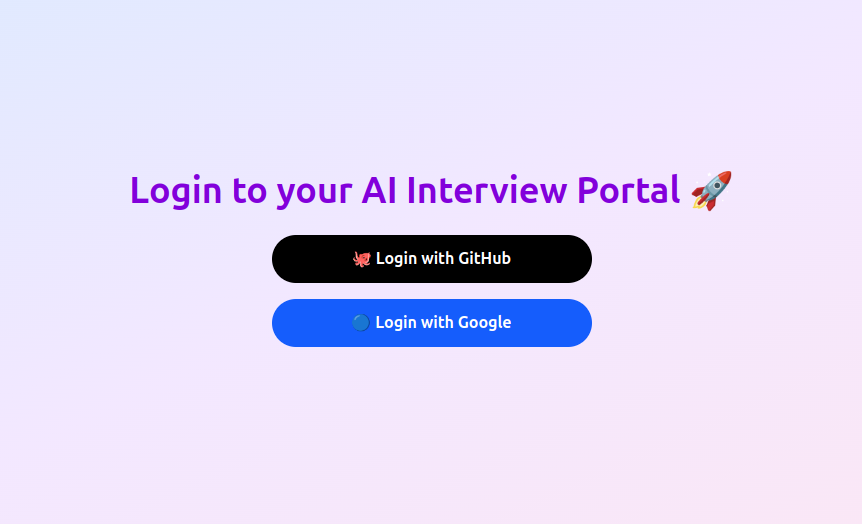

# 🚀 AI Resume Review & Mock Interview Platform

This is a [Next.js](https://nextjs.org) project bootstrapped with [`create-next-app`](https://github.com/vercel/next.js/tree/canary/packages/create-next-app).

A platform that helps users **upload their resumes for AI feedback** and **practice mock interviews** with **real-time scoring and suggestions**. Authentication is handled via **GitHub** and **Google**.

---

## ✨ Features

- 🔒 **Login Authentication** (GitHub and Google)
- 📄 **Resume Upload** (Upload your resume as a PDF and get instant AI feedback)
- 🧠 **Mock Interview** (Practice answering multiple questions and receive scores + feedback)
- ⚡ **Real-Time Feedback** (No delays — feedback is generated immediately)

---

## 📸 Screenshots

> *(Replace the image links below with your own screenshots placed inside a `/screenshots` folder.)*

### 🔑 Login Page


### 📄 Upload Resume


### 🎤 Mock Interview


### 📊 Dashboard


---


## 🚀 Getting Started

First, install dependencies and run the development server:

```bash
npm install
npm run dev
# or
yarn install
yarn dev
# or
pnpm install
pnpm dev
# or
bun install
bun dev
